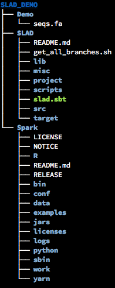
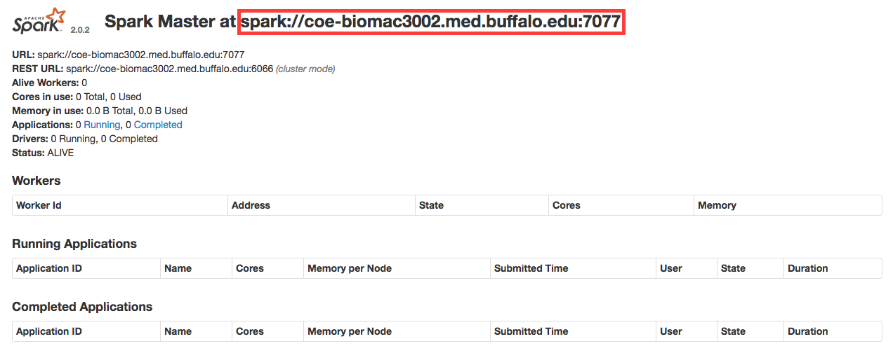
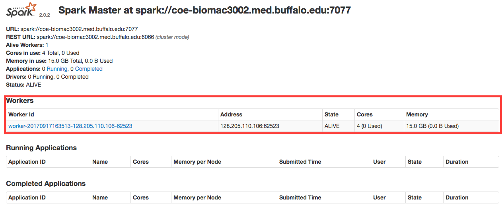

# SLAD

SLAD (Separation via Landmark-based Active Divisive clustering) is a generic computational framework that can be used to parallelize various _de novo_ operational taxonomic unit (OTU) picking methods.

## Requirements

* Scala 2.11
* Java >= 1.6
* Sbt >= 0.13
* Apache Spark >= 2.0

## Demo

A demo of SLAD coupled with [vsearch](https://github.com/torognes/vsearch) on a single multi-core Mac machine.
`vsearch` is a versatile open-source tool for metagenomics.
SLAD also uses [scallop](https://github.com/scallop/scallop) for command-line arguments parsing.

#### Setup

Create a directory for demo and all the following commands are assumed to be run under this directory.
```bash
mkdir SLAD_DEMO && cd SLAD_DEMO
```

Install `Java`, `Scala`, `Sbt` using [`Homebrew`](https://brew.sh/).

```bash
brew cask install java
brew install scala@2.11
brew install sbt
```

Download [Apache Spark](https://spark.apache.org/downloads.html) and decompress to the demo directory.
```bash
tar -xzvf spark-2.X.X-bin-hadoop2.X.tgz && mv spark-2.X.X-bin-hadoop2.X Spark
```

Download [vsearch](https://github.com/torognes/vsearch) and compile it. 
GNU autotools (version 2.63 or later) and the gcc compiler is required to build vsearch.
After compilation, the `vsearch` executable file will be placed under `vsearch/bin`.
```bash
git clone https://github.com/torognes/vsearch.git
cd vsearch
./autogen.sh
./configure
make
```

Download SLAD source code under the demo directory.
```bash
git clone https://github.com/vitmy0000/SLAD.git
```

Download the [demo sequence file](https://buffalo.box.com/s/jm18zyifyeqbb3773w2tsp6bcze3dugt) and create a directory named `Demo` for storing it.

To this end, the demo directory should have the following layout.
```bash
tree -L 2 -C SLAD_DEMO/
```



#### Launch cluster

Start the master node `./Spark/sbin/start-master.sh`, open `http://localhost:8080/` in web browser and get the `MASTER_URL` as highlighted in the following screenshot.

Start a slave node `./Spark/sbin/start-slave.sh <MASTER_URL>`.

To stop the master and slave nodes.
```bash
./Spark/sbin/stop-slave.sh
./Spark/sbin/stop-master.sh
```

#### Compile
```bash
cd SLAD
sbt package
```

#### Run

Check the help information
```bash
../Spark/bin/spark-submit \
--master spark://coe-biomac3002.med.buffalo.edu:7077 \
--conf spark.default.parallelism=16 \
--conf spark.executor.memory=8G \
--class "com.weiz.slad.Program" \
--jars \
../SLAD/lib/scallop_2.11-2.1.2.jar \
../SLAD/target/scala-2.11/slad_2.11-0.1.0.jar \
--help
```

```
        ____  _        _    ____
       / ___|| |      / \  |  _ \
       \___ \| |     / _ \ | | | |
        ___) | |___ / ___ \| |_| |
       |____/|_____/_/   \_\____/

Version 0.1.0 (C) 2016 Wei Zheng
Usage: slad -i INPUT_FILE_PAHT -o OUTPUT_DIR [OPTION]...

SLAD is an Spark based parallel framework for denovo OTU picking.
Options:

      --abundance  <arg>             Sequences with abundance greater than or
                                     equal to this threshold will be treated as
                                     non-trivial sequences.
                                     Required to be posotive integer.
                                     Default: 2
  -i, --input-file-path  <arg>       (REQUIRED)Input fasta file.
      --min-size  <arg>              Clusters with size smaller than this
                                     threshold will not be further partitioned.
                                     Required to be positive integer >= 100
                                     Default: 100
      --num-leave-cluster  <arg>     Number of desired leave clusters
                                     If set to 0, this option has no effect.
                                     Required to be posotive integer or 0.
                                     Default: 0
      --num-power-iteration  <arg>   Number of PIC iterations.
                                     Required to be posotive integer.
                                     Default: 10
  -o, --output-dir  <arg>            (REQUIRED)Output directory.
                                     Directory will be created automatically.
                                     Make sure the directory does not exisit.
                                     Default: "./slad_results"
      --radius  <arg>                Clusters with radius smaller than this
                                     threshold will not be further partitioned.
                                     Required to be a double between 0 and 1.
                                     Default: 0.15
      --random-seed  <arg>           Random seed.
                                     This option will effect landmark selection.
                                     Default: 0
      --word-size  <arg>             Kmer word size.
                                     Required to be positive integer and < 16.
                                     Default: 8
      --help                         Show help message
      --version                      Show version of this program

For all other tricks, consult the documentation!
```

Below is a sample script for demo and it is available under `SLAD/scripts`.
`SET VARIABLES` section should be modified accordingly.
```bash
#!/usr/bin/env bash
set -o errexit
set -o pipefail
# set -o nounset
# set -o xtrace

# SET VARIABLES
INPUT_FASTA="./seqs.fa"
OUTPUT_DIR="./res"
MASTER_URL="spark://coe-biomac3002.med.buffalo.edu:7077"
SPARK_DIR="../Spark"
SLAD_DIR="../SLAD"
VSEARCH_DIR="../vsearch"
MEMORY=8G
NUM_CORE=4
OTU_LEVEL=0.97
NUM_LEAVE_CLUSTER=8
## For termination condition, we recommend to set 
## NUM_LEAVE_CLUSTER to 2 X NUM_CORE
## and leave other two as default.
## Please check the paper for more detailed discussion.
RADIUS=0.15
MIN_SIZE=100
WORD_SIZE=8
ABUNDANCE=2
NUM_POWER_ITERATION=10
RANDOM_SEED=0

# Set magic variables for current file & dir
__dir="$(cd "$(dirname "${BASH_SOURCE[0]}")" && pwd)"
__file="${__dir}/$(basename "${BASH_SOURCE[0]}")"
__base="$(basename ${__file} .sh)"

# Top-level partition phase
rm -rf ${OUTPUT_DIR}
mkdir -p ${OUTPUT_DIR}
time \
${SPARK_DIR}/bin/spark-submit \
--master "${MASTER_URL}" \
--conf spark.default.parallelism=$((4*${NUM_CORE})) \
--conf spark.executor.memory=${MEMORY} \
--class "com.weiz.slad.Program" \
--jars \
${SLAD_DIR}/lib/scallop_2.11-2.1.2.jar \
${SLAD_DIR}/target/scala-2.11/slad_2.11-0.1.0.jar \
--input-file-path "${INPUT_FASTA}" \
--output-dir "${OUTPUT_DIR}" \
--word-size ${WORD_SIZE} \
--abundance ${ABUNDANCE} \
--radius ${RADIUS} \
--min-size ${MIN_SIZE} \
--num-leave-cluster ${NUM_LEAVE_CLUSTER} \
--num-power-iteration ${NUM_POWER_ITERATION} \
--random-seed ${RANDOM_SEED} \
2> /dev/null 
${VSEARCH_DIR}/bin/vsearch -usearch_global "${INPUT_FASTA}" -db "${OUTPUT_DIR}/landmarks.fa" -id 0.6 -blast6out "${OUTPUT_DIR}/hit.txt" -strand plus -threads ${NUM_CORE}
mkdir res/clusters/
python ${SLAD_DIR}/scripts/partition.py -f "${INPUT_FASTA}" -u "${OUTPUT_DIR}/hit.txt" -o "${OUTPUT_DIR}/clusters" -c "${OUTPUT_DIR}/sub_count.txt"
rm -r res/derep
rm -r res/partition

# Sub-clustering phase
for x in $(ls ${OUTPUT_DIR}/clusters/); do
    { \
    ../vsearch/bin/vsearch --sortbylength ${OUTPUT_DIR}/clusters/${x} --output ${OUTPUT_DIR}/clusters/${x}_sorted.fa; \
    ../vsearch/bin/vsearch -cluster_smallmem ${OUTPUT_DIR}/clusters/${x}_sorted.fa -id ${OTU_LEVEL} -centroids ${OUTPUT_DIR}/clusters/${x}_centroids.fa -userout ${OUTPUT_DIR}/clusters/${x}_user.txt -userfields query+target+id; \
    rm ./res/clusters/${x}_sorted.fa; \
    } &
done
for job in `jobs -p`; do
    wait $job
done

echo 'All done!'
```

To run the demo script.
```bash
cd SLAD_DEMO/Demo
cp ../SLAD/scripts/demo.sh .
bash demo.sh
```

### EC2


## Tips
