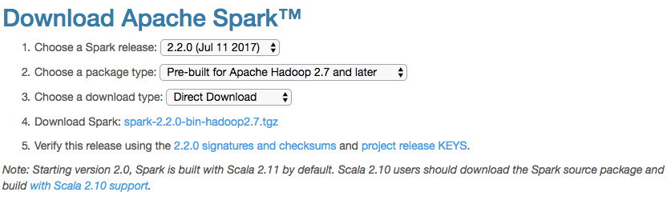

# SLAD

SLAD (Separation via Landmark-based Active Divisive clustering) is a generic computational framework that can be used to parallelize various _de novo_ operational taxonomic unit (OTU) picking methods.

## Requirements

* Scala 2.11
* Java >= 1.6
* Sbt >= 0.13
* Apache Spark >= 2.0

## Demo

A demo of SLAD coupled with [UCLUST](https://www.drive5.com/usearch/download.html) with a single multi-core Mac machine.

#### Setup

Create a directory for demo and all the following commands are assumed to be run under this directory.
```bash
mkdir SLAD_DEMO && cd SLAD_DEMO
```

Install `Java`, `Scala`, `Sbt` using [`Homebrew`](https://brew.sh/).

```bash
brew cask install java
brew install scala@2.11
brew install sbt
```

Download [Apache Spark](https://spark.apache.org/downloads.html) and decompress to the demo directory, `tar -xzvf spark-2.X.X-bin-hadoop2.X.tgz && mv spark-2.X.X-bin-hadoop2.X Spark`.


Download SLAD source code under the demo directory.
```bash
git clone https://github.com/vitmy0000/SLAD.git
```

Download the [demo sequence file](https://buffalo.box.com/s/jm18zyifyeqbb3773w2tsp6bcze3dugt) and create a directory named `Demo` for storing it.

To this end, the demo directory should have the following layout.


#### Launch cluster

Start the master node `./Spark/sbin/start-master.sh`, open `http://localhost:8080/` in web browser and get the `MASTER_URL` as highlighted in the following screenshot.

Start a slave node `./Spark/sbin/start-slave.sh <MASTER_URL>`.

To stop the master and slave nodes.
```bash
./Spark/sbin/stop-slave.sh
./Spark/sbin/stop-master.sh
```

#### Compile
```bash
cd SLAD
sbt package
```

#### Run

Below is a sample script for demo and it is available under `SLAD/scripts`.
```bash
#!/usr/bin/env bash
set -o errexit
set -o pipefail
set -o nounset
# set -o xtrace

# Set magic variables for current file & dir
__dir="$(cd "$(dirname "${BASH_SOURCE[0]}")" && pwd)"
__file="${__dir}/$(basename "${BASH_SOURCE[0]}")"
__base="$(basename ${__file} .sh)"

# Arguments
if [ "$#" -ne 1 ]; then
    echo "Please provide <MASTER_URL>"
    exit
fi
MASTER_URL="${1}"

# Top-level partition phase
rm -rf res
mkdir -p res
time \
../Spark/bin/spark-submit \
--master "${MASTER_URL}" \
--conf spark.default.parallelism=16 \
--conf spark.executor.memory=8G \
--conf spark.eventLog.enabled=false \
--class "com.weiz.slad.Program" \
--jars \
../SLAD/lib/scallop_2.11-2.1.2.jar \
../SLAD/target/scala-2.11/slad_2.11-0.1.0.jar \
--input-file-path "./seqs.fa" \
--output-dir "./res/" \
--word-size 8 \
--abundance 2 \
--radius 0.17 \
--min-size 500 \
--num-leave-cluster 0 \
--num-power-iteration 10 \
--random-seed 0 \
2> /dev/null
../SLAD/scripts/u9_mac -usearch_global "./seqs.fa" -db "./res/landmarks.fa" -id 0.6 -blast6out "./res/hit.txt" -strand plus -threads 4
mkdir res/clusters/
python ../SLAD/scripts/partition.py -f ./seqs.fa -u ./res/hit.txt -o ./res/clusters -c ./res/sub_count.txt
rm -r res/derep
rm -r res/partition

# Sub-clustering phase
for x in $(ls ./res/clusters/); do
    { \
    ../SLAD/scripts/u9_mac --sortbylength ./res/clusters/${x} --fastaout ./res/clusters/${x}_sorted.fa; \
    ../SLAD/scripts/u9_mac -cluster_smallmem ./res/clusters/${x}_sorted.fa -id 0.97 -centroids ./res/clusters/${x}_centroids.fa -userout ./res/clusters/${x}_user.txt -userfields query+target+id; \
    rm ./res/clusters/${x}_sorted.fa; \
    } &
done
for job in `jobs -p`; do
    wait $job
done

echo 'All done!'
```

Tips
* All result files are placed under `Demo/res`.
* For different _de novo_ OTU picking method, different sub-clustering phase script should be applied

To run the demo script.
```bash
cd SLAD_DEMO/Demo
cp ../SLAD/scripts/demo.sh .
bash demo.sh <MASTER_URL>
```

### EC2
